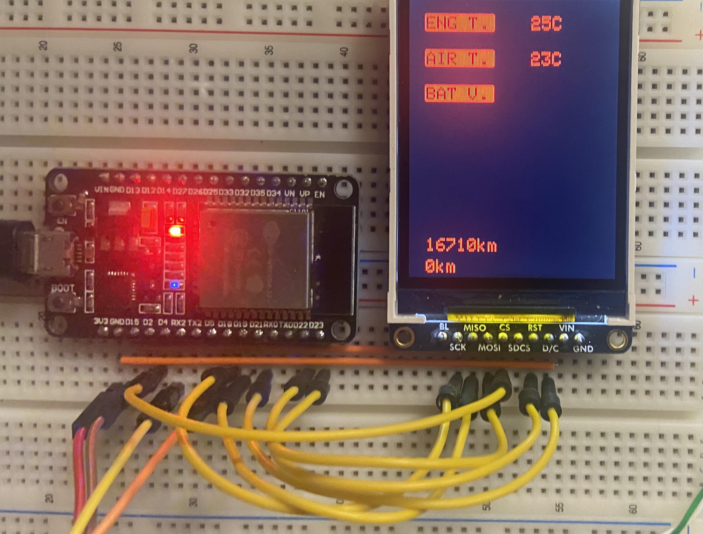

# ESP32_CarCAN
ESP32 CAN-Bus Sniffer for Car Data Display on an LCD Screen

The ESP32 communicates with the car via the Adafruit CAN-Bus transceiver.  
Data is requested using the OBD-II standard and displayed on an LCD screen.

## Hardware
- ESP32 NODEMCU-32S
- Adafruit TJA1051T/3
- Adafruit ILI9341

## Sources 
- [OBD-II PIDs](https://en.wikipedia.org/wiki/OBD-II_PIDs)
- [MrDIY - Car's CAN](https://www.youtube.com/watch?v=Se2KCVyD7CM)
- [Electronoobs - CAN Bus](https://www.youtube.com/watch?v=JZSCzRT9TTo)
